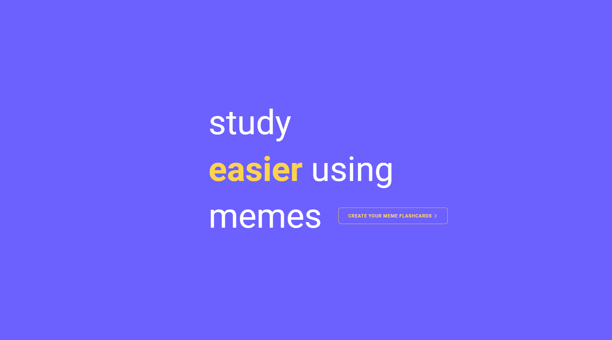
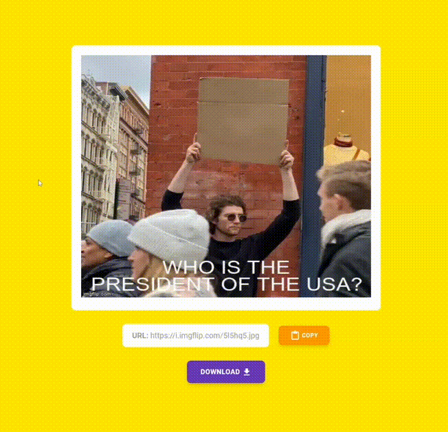

# Memelet
A meme flash card generator.

This is a project that was created at WaffleHacks

## How does it work?
1) Ask a question

2) If you want, you can provide an optional answer to your question (if you do not provide an answer, Memelet will find the correct answer for you)

3) Your unique meme will be generated

4) Profit Study, or share your flashcard memes with your friends

Feel free to try it out yourself: https://www.memelet.study/

 
 
 

 
 
 

## Technical Stacks:
* React
* Next.js
* TailwindCSS
* Python

## APIs
* [Wolfram Alpha](https://www.wolframalpha.com)
* [imgflip](https://imgflip.com)

## Can this help you study?
Many student tends to procrasinate during their school life. While procrasinating, students like to scroll through memes on Instagram or Reddit. This allows students to procrasinate while studying for their exams at the same time with generated memes containing their study materials. 👍 

## Why use Memelet instead of regular flashcards?
1) It is easier to remember memes than it is to remember information. According to Psychology Today: "Words are abstract and rather difficult for the brain to retain, whereas visuals are concrete and, as such, more easily remembered". Memelet leverages this fact by helping your brain associate pieces of information with meme visuals.
